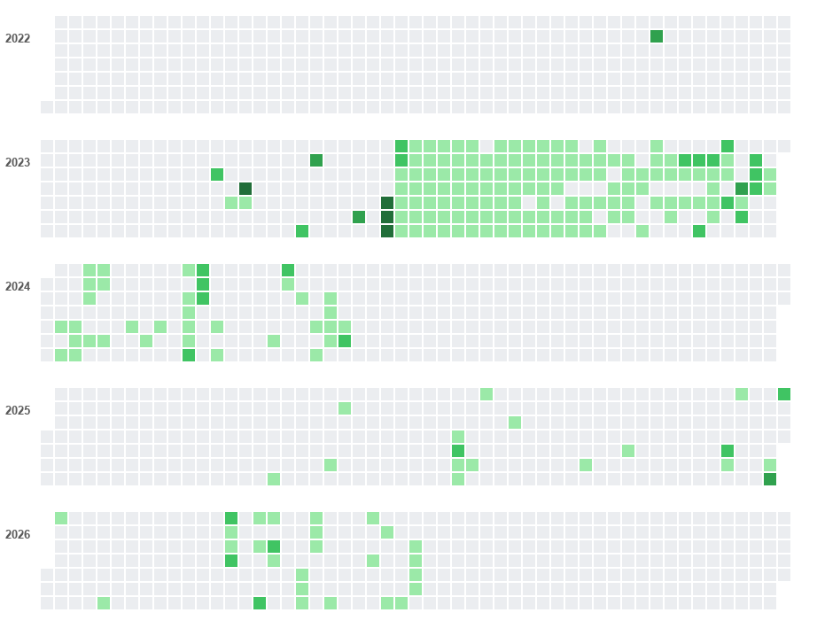

# Hi, I'm Yang(Simon) 👋

This is a fresh GitHub account.

> ℹ️ **About my history**
> My previous account held ~4 years and 600+ commits of work. In July 2026 it was **flagged by GitHub's automated abuse-detection system** — most likely a false positive triggered by changing repository/Pages visibility settings too many times in a short window. The account is currently hidden from the public and under appeal.
> In the meantime, this account is where my projects live. The graph below is a **snapshot of my real commit history**, reconstructed from my previous account's official data export. It's a historical record — not this account's live contribution graph.

## 📊 Commit history (2022–2026, from previous account export)

| | |
|---|---|
| Total commits | **613** |
| Active days | **236** |
| Longest streak | **45** days |
| Busiest day | 2023-06-22 (16 commits) |
| Span | Oct 2022 → Jul 2026 |
